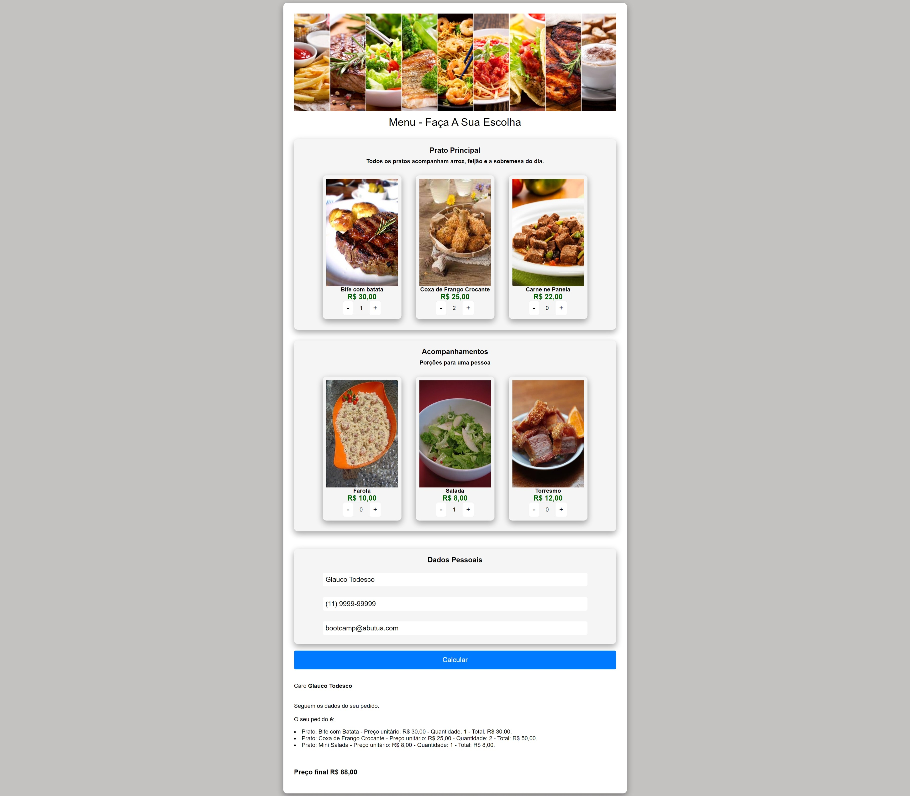

# Bootcamp DevJr Módulo03: Projeto Menu

# Recursos do repositório (Resolvido):

### Imagens de referência do projeto
### Imagens do projeto (assets)
### 4 exemplos de necessários para a execução do projeto

## Modelo do projeto! 

## Acompanhe a [minha solução](https://willian-uiu.github.io/Cardapio/cardapio/)
